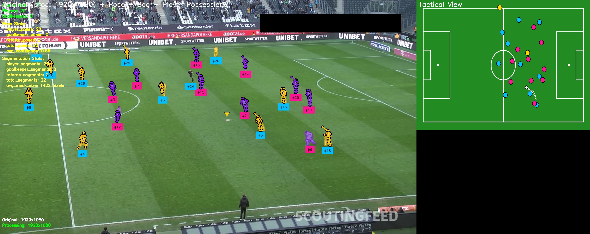
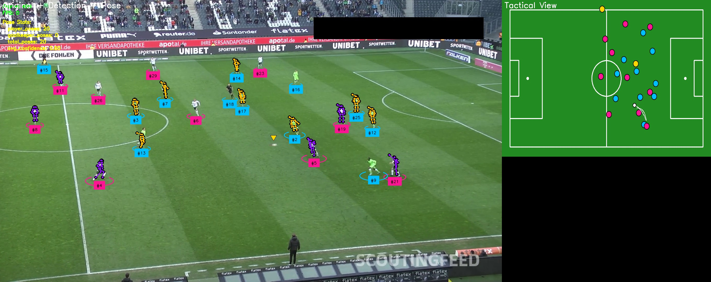

# Football AI - Computer Vision System for Football Analysis

A simple computer vision system that analyzes football match videos to detect players, track ball movement, classify teams, and provide tactical visualizations.

## Preview






## Features

- **Player Detection**: Identifies players, goalkeepers, and referees in real-time
- **Team Classification**: Automatically classifies players into their respective teams
- **Ball Tracking**: Tracks ball movement with trail visualization
- **Field Detection**: Detects field keypoints for perspective transformation
- **Tactical View**: Creates top-down pitch view with player positions
- **Caching System**: Caches trained models for faster processing
- **Modular Architecture**: Clean, testable code structure

## Demo Output

The system generates a side-by-side view:
- Left: Original video with detection overlays
- Right: Top-down tactical view of the pitch

## Requirements

- Python 3.9+
- CUDA-capable GPU (optional but recommended)
- Docker and Docker Compose (for containerized deployment)

## Installation

### Option 1: Local Installation

1. Clone the repository:
```bash
git clone <repository-url>
cd football_ai
```

2. Install dependencies:
```bash
pip install -r requirements.txt
```

3. Configure your settings:
```bash
cp config.yaml.example config.yaml
# Edit config.yaml with your API keys and paths
```

### Option 2: Docker Installation

1. Clone the repository:
```bash
git clone <repository-url>
cd football_ai
```

2. Build and run with Docker Compose:
```bash
docker-compose up --build
```

## Configuration

Edit `config.yaml` to configure:

### API Keys
```yaml
api_keys:
  huggingface_token: "your_hf_token"
  roboflow_api_key: "your_roboflow_key"
```

### Model Settings
```yaml
models:
  player_detection_model_id: "football-players-detection-3zvbc/11"
  field_detection_model_id: "football-field-detection-f07vi/14"
  siglip_model_path: "google/siglip-base-patch16-224"
```

### Video Processing
```yaml
video:
  input_path: "/path/to/your/video.mp4"
  output_path: "/path/to/output.mp4"
  stride: 30  # Frame sampling for training
```

### Performance Settings
```yaml
performance:
  use_gpu: true
  device: "cuda"  # or "cpu"
```

## Usage

### Process a Video

```bash
python main.py --config config.yaml --output output_video.mp4
```

### Test Single Frame

```bash
python tests/debug_single_frame.py --config config.yaml --image test_frame.jpg
```

### Using Docker

```bash
# Process video with Docker
docker-compose run football-ai python main.py --config /app/config.yaml --output /app/output/result.mp4

# Interactive shell
docker-compose run football-ai bash
```

## Project Structure

```
football_ai/
├── config.yaml              # Configuration file
├── requirements.txt         # Python dependencies
├── Dockerfile              # Docker image definition
├── docker-compose.yml      # Docker Compose configuration
├── main.py                 # Main entry point
├── config/                 # Configuration management
│   ├── __init__.py
│   └── config_loader.py
├── models/                 # AI models
│   ├── __init__.py
│   ├── detector.py         # Object detection
│   ├── classifier.py       # Team classification
│   └── tracker.py          # Object tracking
├── processing/             # Core processing logic
│   ├── __init__.py
│   ├── frame_processor.py  # Frame processing pipeline
│   ├── team_resolver.py    # Team assignment logic
│   └── coordinate_transformer.py
├── visualization/          # Rendering and annotation
│   ├── __init__.py
│   ├── annotators.py       # Frame annotation
│   └── pitch_renderer.py   # Tactical view rendering
├── caching/               # Cache management
│   ├── __init__.py
│   └── cache_manager.py
├── utils/                 # Utilities
│   ├── __init__.py
│   └── video_utils.py
└── tests/                 # Test scripts
    ├── __init__.py
    └── debug_single_frame.py
```

## API Keys Setup

### Hugging Face Token
1. Create account at [huggingface.co](https://huggingface.co)
2. Generate token at [huggingface.co/settings/tokens](https://huggingface.co/settings/tokens)
3. Add to config.yaml

### Roboflow API Key
1. Create account at [roboflow.com](https://roboflow.com)
2. Get API key from account settings
3. Add to config.yaml

## Performance Tips

1. **GPU Acceleration**: Ensure CUDA is properly installed for GPU support
2. **Frame Stride**: Increase stride value for faster processing (may reduce accuracy)
3. **Caching**: Enable caching to reuse trained classifiers
4. **Batch Processing**: Process multiple videos sequentially

## Troubleshooting

### CUDA not available
```bash
# Check CUDA availability
python -c "import torch; print(torch.cuda.is_available())"
```

### Model loading issues
- Verify internet connection
- Check API keys are valid
- Ensure model paths in config are correct

### Memory issues
- Reduce batch_size in config
- Process shorter video segments
- Use CPU mode if GPU memory limited

### Cache issues
```bash
# Clear cache
rm -rf .cache/
```

## Contributing

1. Fork the repository
2. Create feature branch (`git checkout -b feature/improvement`)
3. Commit changes (`git commit -am 'Add feature'`)
4. Push to branch (`git push origin feature/improvement`)
5. Create Pull Request

## License

[Specify your license here]

## Acknowledgments

- [Roboflow](https://roboflow.com) for object detection models
- [Hugging Face](https://huggingface.co) for transformer models
- [supervision](https://github.com/roboflow/supervision) for computer vision utilities

## Support

For issues and questions:
- Create an issue on GitHub
- Check existing issues for solutions
- Ensure config.yaml is properly set up

## Citation

If you use this in research, please cite:
```bibtex
@software{football_ai,
  title = {Football AI: Computer Vision System for Football Analysis},
  year = {2024},
  url = {https://github.com/farshidrayhancv/football-ai}
}
```
