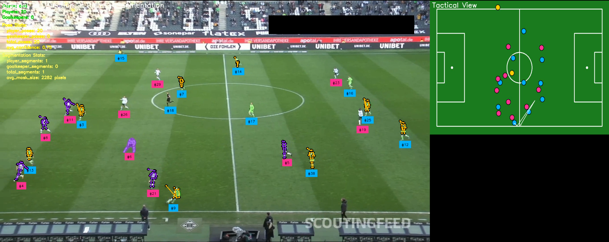

# ⚽ Football AI - Computer Vision System for Football Analysis

<div align="center">
<p>
   <a href="#"></a>
   <a href="#"></a>
   <a href="#"></a>
   <a href="#"></a>
   <a href="#"></a>
</p>

<p>
   <strong>🚀 Real-time football analysis with state-of-the-art computer vision</strong>
</p>

<p>
   <a href="#-features">Features</a> •
   <a href="#-quick-start">Quick Start</a> •
   <a href="#-installation">Installation</a> •
   <a href="#-usage">Usage</a> •
   <a href="#-demo">Demo</a> •
   <a href="#-contributing">Contributing</a>
</p>
</div>

## 🎯 Overview

A powerful computer vision system that analyses football match videos to detect players, track ball movement, classify teams, provide tactical visualisations, and identify which player has possession of the ball - all in real-time! 

## 🖼️ Preview

<div align="center">

### 🔍 Object Detection + Tracking


### 🏃 (Object Detection + Tracking) + Pose Estimation


### 🎭 (Object Detection + Tracking) + Pose Estimation + Segmentation (Player #6)


### 🏆 Player Possession Detection


</div>

## ✨ Features

- **🏃 Player Detection**: Real-time identification of players, goalkeepers, and referees
- **👥 Team Classification**: Automatic team assignment using AI-powered classification
- **⚡ Ball Tracking**: Advanced ball tracking with trajectory visualisation
- **🏟️ Field Detection**: Keypoint detection for perspective transformation
- **🤸 Pose Estimation**: Human pose estimation with adaptive padding for better accuracy
- **🎯 Player Segmentation**: Precise player segmentation with size-adaptive bounding boxes
- **👐 Player Possession Detection**: Identify which player has the ball and highlight them in real-time
- **🔲 SAHI Integration**: 2x2 slicing for enhanced detection accuracy
- **📊 Tactical View**: Top-down pitch visualisation with real-time positions
- **💾 Smart Caching**: Intelligent model caching for optimal performance
- **🧩 Modular Design**: Clean, testable, and maintainable code architecture
- **📐 Adaptive Padding**: Size-aware padding for improved pose and segmentation quality
- **🖥️ Resolution Control**: Customizable processing resolution for speed/quality balance

## 🎬 Demo Output

The system generates a professional side-by-side view:
- **Left Panel**: Original video with AI overlays and annotations, including possession highlighting
- **Right Panel**: Top-down tactical view showing player positions

## 📋 Requirements

- 🐍 Python 3.9+
- 🎮 CUDA-capable GPU (optional but recommended)
- 🐳 Docker and Docker Compose (for containerised deployment)

## ⚠️ Current Limitations

- ⏱️ Processing speed: 1 frame per 3-4 seconds
- 🎯 Only object detection models are purpose-trained
- 🤸 Pose detection challenges with occlusion
- 👥 Some player poses may not be detected accurately
- 🏀 Ball possession is detected based on proximity, not visual contact

## 🚀 Quick Start

```bash
# Clone the repo
git clone https://github.com/farshidrayhancv/football-ai
cd football_ai

# Install dependencies
pip install -r requirements.txt

# Configure settings
cp config.yaml.example config.yaml

# Run analysis
python main.py --config config.yaml --output output_video.mp4
```

## 🛠️ Installation

### 📦 Option 1: Local Installation

1. **Clone the repository:**
```bash
git clone https://github.com/farshidrayhancv/football-ai
cd football_ai
```

2. **Install dependencies:**
```bash
pip install -r requirements.txt
```

3. **Configure your settings:**
```bash
cp config.yaml.example config.yaml
# Edit config.yaml with your API keys and paths
```

### 🐳 Option 2: Docker Installation

1. **Clone the repository:**
```bash
git clone https://github.com/farshidrayhancv/football-ai
cd football_ai
```

2. **Build and run with Docker Compose:**
```bash
docker-compose up --build
```

## ⚙️ Configuration

Edit `config.yaml` to customise your setup:

### 🔑 API Keys
```yaml
api_keys:
  huggingface_token: "your_hf_token"
  roboflow_api_key: "your_roboflow_key"
```

### 🤖 Model Settings
```yaml
models:
  player_detection_model_id: "football-players-detection-3zvbc/11"
  field_detection_model_id: "football-field-detection-f07vi/14"
  siglip_model_path: "google/siglip-base-patch16-224"
```

### 🎥 Video Processing
```yaml
video:
  input_path: "/path/to/your/video.mp4"
  output_path: "/path/to/output.mp4"
  stride: 30  # Frame sampling for training
```

### 📐 Adaptive Padding
```yaml
detection:
  # Adaptive padding for pose estimation
  pose_bbox_padding: 50
  pose_bbox_padding_ratio: 0.5
  # Adaptive padding for segmentation
  segmentation_padding: 30
  segmentation_padding_ratio: 0.3
```

### 🏆 Player Possession Detection
```yaml
possession_detection:
  # Enable player possession detection
  enable: true
  # Distance in pixels for a player to be considered in possession
  proximity_threshold: 50
  # Number of frames a player needs to be closest to be in possession
  possession_frames: 3
```

### 🖥️ Processing Resolution
```yaml
processing:
  # Set a custom processing resolution for speed
  resolution: [960, 540]  # Width, height
```

### ⚡ Performance Settings
```yaml
performance:
  use_gpu: true
  device: "cuda"  # or "cpu"
```

## 💻 Usage

### 🎬 Process a Video

```bash
python main.py --config config.yaml --output output_video.mp4
```

### 🧪 Test Player Possession Detection

```bash
python tests/test_player_possession.py --config config.yaml --video test_video.mp4
```

### 🐳 Using Docker

```bash
# Process video with Docker
docker-compose run football-ai python main.py --config /app/config.yaml --output /app/output/result.mp4

# Interactive shell
docker-compose run football-ai bash
```

## 📁 Project Structure

```
football_ai/
├── 📄 config.yaml              # Configuration file
├── 📋 requirements.txt         # Python dependencies
├── 🐳 Dockerfile              # Docker image definition
├── 🐳 docker-compose.yml      # Docker Compose configuration
├── 🏃 main.py                 # Main entry point
├── ⚙️  config/                 # Configuration management
│   ├── __init__.py
│   └── config_loader.py
├── 🤖 models/                 # AI models
│   ├── __init__.py
│   ├── detector.py            # Object detection with adaptive padding
│   ├── classifier.py          # Team classification
│   ├── tracker.py             # Object tracking
│   └── player_possession_detector.py # Player possession detection
├── 🔄 processing/             # Core processing logic
│   ├── __init__.py
│   ├── frame_processor.py     # Frame processing pipeline
│   ├── team_resolver.py       # Team assignment logic
│   ├── sahi_processor.py      # SAHI support for small objects
│   └── coordinate_transformer.py
├── 🎨 visualisation/          # Rendering and annotation
│   ├── __init__.py
│   ├── annotators.py          # Frame annotation
│   └── pitch_renderer.py      # Tactical view rendering
├── 💾 caching/               # Cache management
│   ├── __init__.py
│   └── cache_manager.py
├── 🛠️  utils/                 # Utilities
│   ├── __init__.py
│   └── video_utils.py
└── 🧪 tests/                 # Test scripts
    ├── __init__.py
    ├── test_adaptive_padding.py  # Test adaptive padding
    ├── test_player_possession.py # Test player possession detection
    └── debug_single_frame.py
```

## 🔑 API Keys Setup

### 🤗 Hugging Face Token
1. Create account at [huggingface.co](https://huggingface.co)
2. Generate token at [huggingface.co/settings/tokens](https://huggingface.co/settings/tokens)
3. Add to config.yaml

### 🔷 Roboflow API Key
1. Create account at [roboflow.com](https://roboflow.com)
2. Get API key from account settings
3. Add to config.yaml

## 📐 Adaptive Padding System

The system uses a sophisticated adaptive padding approach that:

1. **Analyzes object size**: Smaller (distant) players get proportionally more padding
2. **Uses different settings**: Separate parameters for pose estimation and segmentation 
3. **Improves distant player detection**: Better pose estimation for players far from camera
4. **Maintains object context**: Ensures enough surrounding information for accurate detection

## 👐 Player Possession Detection

The system includes a player possession detection feature that:

1. **Identifies which player has the ball**: Uses proximity detection between player and ball
2. **Tracks possession over time**: Requires consistent proximity over multiple frames
3. **Visualizes possession**: Highlights the player with possession and displays their tracking ID
4. **Works with all player types**: Supports players, goalkeepers, and referees
5. **Configurable parameters**: Adjust proximity threshold and frames required for possession

## 🚀 Performance Tips

1. **🎮 GPU Acceleration**: Ensure CUDA is properly installed for GPU support
2. **📊 Frame Stride**: Increase stride value for faster processing (may reduce accuracy)
3. **💾 Caching**: Enable caching to reuse trained classifiers
4. **⚡ Batch Processing**: Process multiple videos sequentially
5. **🖥️ Processing Resolution**: Lower the processing resolution for faster performance
6. **📐 Adaptive Padding**: Adjust padding parameters to balance accuracy and performance

## 🔧 Troubleshooting

### 🎮 CUDA not available
```bash
# Check CUDA availability
python -c "import torch; print(torch.cuda.is_available())"
```

### 📦 Model loading issues
- ✅ Verify internet connection
- ✅ Check API keys are valid
- ✅ Ensure model paths in config are correct

### 💾 Memory issues
- Reduce batch_size in config
- Process shorter video segments
- Use CPU mode if GPU memory limited
- Lower processing resolution in config

### 🗑️ Cache issues
```bash
# Clear cache
rm -rf .cache/
```

## 🤝 Contributing

1. Fork the repository
2. Create feature branch (`git checkout -b feature/amazing-feature`)
3. Commit changes (`git commit -am '✨ Add amazing feature'`)
4. Push to branch (`git push origin feature/amazing-feature`)
5. Create Pull Request

## 📄 Licence

This project is licensed under the MIT Licence - see the [LICENCE](LICENCE) file for details.

## 🙏 Acknowledgements

- [Roboflow](https://roboflow.com) - Object detection models
- [Hugging Face](https://huggingface.co) - Transformer models
- [supervision](https://github.com/roboflow/supervision) - Computer vision utilities
- [Ultralytics](https://github.com/ultralytics/ultralytics) - YOLO models
- [SAM](https://segment-anything.com) - Segment Anything Model

## 📞 Support

For issues and questions:
- 🐛 Create an issue on GitHub
- 💬 Check existing issues for solutions
- ⚙️ Ensure config.yaml is properly set up

## 📚 Citation

If you use this in research, please cite:
```bibtex
@software{football_ai,
  title = {Football AI: Computer Vision System for Football Analysis},
  year = {2024},
  url = {https://github.com/farshidrayhancv/football-ai}
}
```

---

This project is a hobby project and is not intended for production use. It is provided as-is and is not guaranteed to be a robust and scalable solution for real-time football analysis. It leverages cutting-edge computer vision techniques and state-of-the-art models to provide insights into player positions, ball trajectories, team compositions, and tactical decisions. The system is built to handle large datasets and real-time processing, ensuring that it can provide accurate and timely analysis during live matches if other parts of the system are properly optimised.